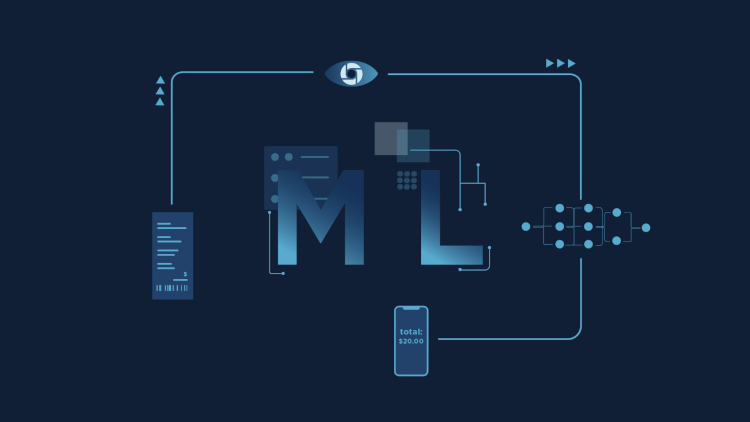

# Machine-Learning-Projects-
This contains all the ML projects

- All machine learning projects at same place.

## Algorithms Used

All sorts of algorithms are used in the projects:
### Regression

- Linear Regression
- Logistic Regression
- Polynomial Regression
- Lasso Regression
- Ridge Regression

### Classification

- K-Nearest Neighbours
- Support Vector Machine
- Naive Bayes
- Decision Tree

### Clustering

- K-Means

### Ensemble

- Random Forest
